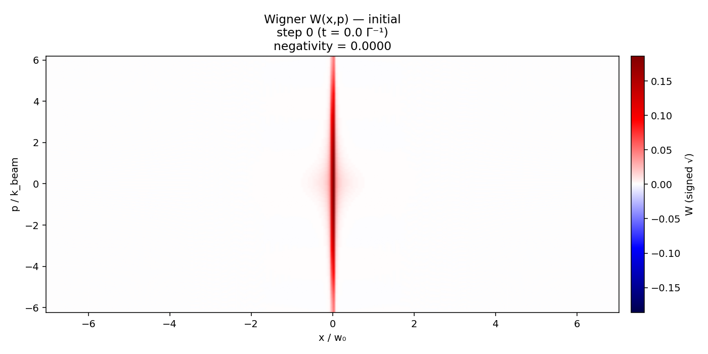
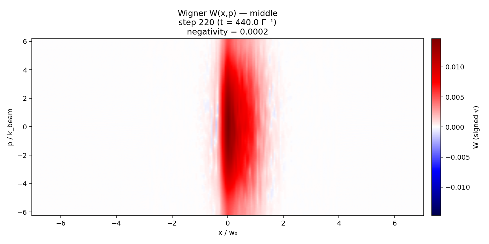
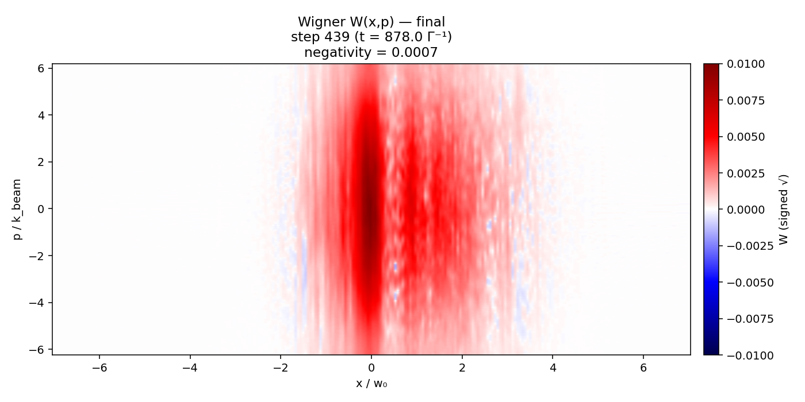
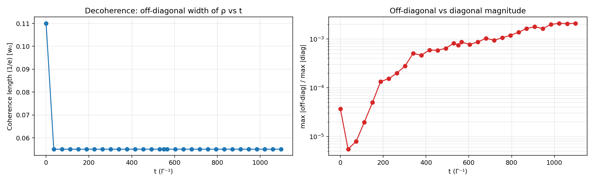
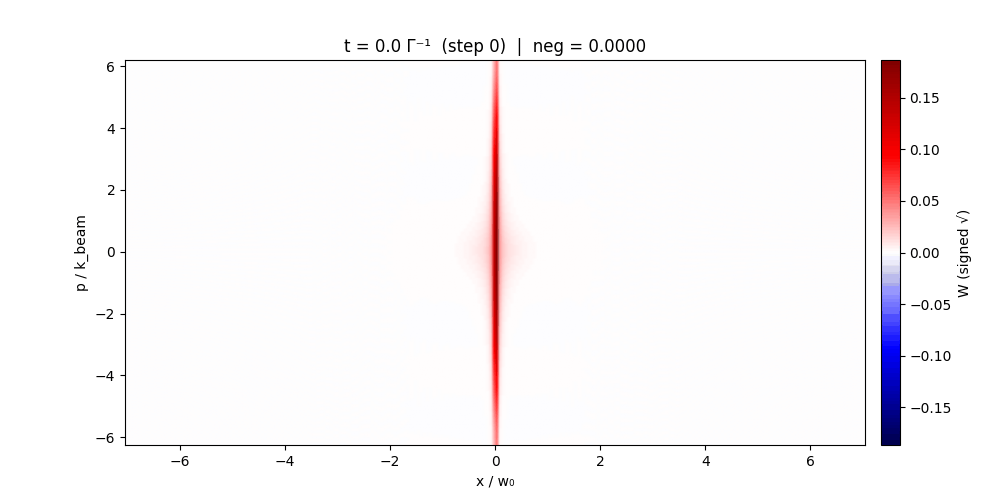

# soft-mcwf

A grid-based Monte Carlo Wave Function (MCWF) solver for open quantum systems with soft potentials, built from scratch using NumPy. Applied to quantum heating dynamics in Gaussian traps and optical lattices, with direct comparison to classical trajectory simulations.

## Motivation

Standard quantum optics toolkits (QuTiP) represent motional states in the Fock (harmonic oscillator) basis — natural for harmonic traps but poorly suited to anharmonic potentials like Gaussian tweezers or optical lattices, where many Fock states are needed for convergence. This solver instead works directly on a real-space momentum grid, representing the motional wavefunction as $\psi(p)$ with position obtained via FFT. This is efficient and exact for arbitrary soft potentials.

The internal (electronic) state is a two-level system (TLS) $\{|g\rangle, |e\rangle\}$ represented as a 2-component spinor at each grid point. The full state is a block vector of shape `[N_grid, 2]`.

Dissipation from spontaneous emission is handled via quantum trajectories: the wavefunction evolves under a non-Hermitian Hamiltonian $H_\text{eff} = H - \frac{i}{2}\sum_j L_j^\dagger L_j$, with stochastic quantum jumps applied when the norm drops below a random threshold.

## Structure

```
mcwf/
  solver.py          — full MCWF engine: grid init, operators, propagator, jump detection

examples/
  gaussian_well/
    config.py        — physical parameters (Yb-171, 399 nm imaging, Gaussian tweezer)
    run.py           — quantum MCWF simulation: state-dependent Gaussian traps
    classical.py     — classical trajectory simulation of the same system
    analyse.py       — trajectory analysis: energy, survival, heating rate
  lattice_heating/
    config.py        — parameters (Yb-171, 759 nm lattice, 399 nm imaging)
    run.py           — quantum MCWF simulation: atom in periodic potential
    sitepopulations.py — Wannier site population analysis
    wigner.py        — Wigner function computation and plotting
    analyse.py       — trajectory analysis: coherence, heating, loss

results/
  lattice_heating/   — Wigner functions, site population dynamics, density matrix evolution
```

## Key features

- **Real-space grid** — momentum-space wavefunction on a uniform grid; position via FFT. Arbitrary potentials with no basis truncation issues
- **Split-operator propagation** — kinetic and potential evolution applied in alternating half-steps; analytic TLS propagator for the internal state
- **Block-diagonal structure** — Hamiltonian is block-diagonal in position: $H(x) = H_\text{kin}(p) \otimes I_\text{TLS} + I_\text{space} \otimes H_\text{TLS} + V(x) \otimes P_\sigma$, exploiting the fact that the potential is diagonal in position space
- **Quantum jumps** — norm-monitoring MCWF: jump applied when $\|\psi\|^2 < r \sim \text{Uniform}(0,1)$; jump channel selected by relative rates
- **Parallelised trajectories** — `joblib.Parallel` over independent trajectory instances; results saved incrementally to disk
- **Classical comparison** — Numba-accelerated classical simulation of the same physical system for direct quantum vs classical comparison

## Physical systems

### Gaussian tweezer — state-dependent traps (Yb-171)

A Yb-171 atom is trapped in a Gaussian optical tweezer $V(x) = -V_0 e^{-x^2/2\sigma^2}$. The ground and excited electronic states see different trap depths ($V_\text{gs} \neq V_\text{es}$), modelling a non-magic-wavelength trap. Imaging photons are scattered at rate $\Gamma$, imparting recoil kicks $\pm\hbar k$ and causing state-dependent heating.

The simulation tracks the quantum trajectory of the motional + internal state, enabling direct comparison of quantum tunnelling and energy distribution against the classical (Newton's equations + stochastic kicks) limit.

### Optical lattice heating (Yb-171)

An atom in a 1D optical lattice $V(x) = -V_0 \cos^2(k_L x)$ (759 nm) is continuously imaged with a near-resonant beam (399 nm). The imaging process drives transitions between internal states and imparts photon recoil, causing heating and eventual loss from the lattice.

Observables: Wigner function evolution, site population dynamics, off-diagonal coherence of the density matrix, loss rate.

## Results

**Wigner function evolution** (lattice heating):

| Initial | Mid-evolution | Final |
|---|---|---|
|  |  |  |

**Site population dynamics and coherence:**



**Phase-space evolution (animated):**



## Method: MCWF propagator

Between jumps, the wavefunction evolves as:

$$i\hbar \partial_t |\psi\rangle = H_\text{eff} |\psi\rangle, \quad H_\text{eff} = H - \frac{i}{2}\sum_j L_j^\dagger L_j$$

The kinetic part is evolved in momentum space; the potential + TLS part in position space. At each step:

1. Half-step kinetic: $\psi(p) \to e^{-i p^2 \Delta t / 4m} \psi(p)$
2. Full-step potential + TLS: $\psi(x) \to e^{-i H_\text{loc}(x) \Delta t} \psi(x)$ (analytic $2\times2$ matrix exponential per grid point)
3. Half-step kinetic again
4. Check norm; apply jump if $\|\psi\|^2 < r$

## Relation to multimode-tdvp

The exact MCWF results serve as a reference for the variational Gaussian TDVP solver in [multimode-tdvp](https://github.com/krishnasogathur/multimode-tdvp). The lattice heating problem is a target benchmark: the grid-based approach is exact but scales as $O(N_\text{grid})$ per step, while TDVP scales as $O(N_\text{Gauss}^2 \times d)$ and extends naturally to multiple modes.

## Requirements

```
numpy
scipy
joblib
matplotlib
numba    # for classical simulation
```
